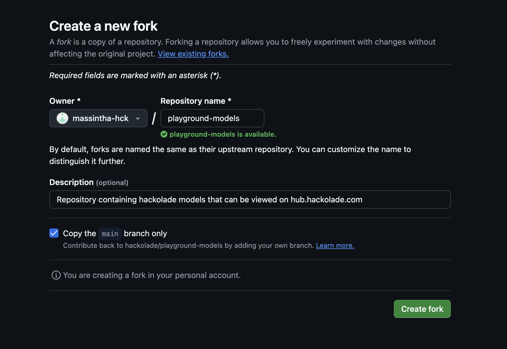
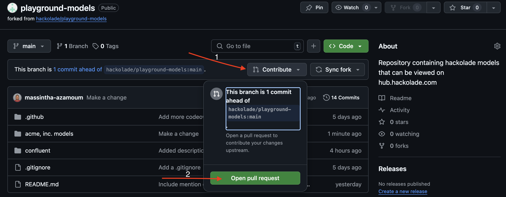
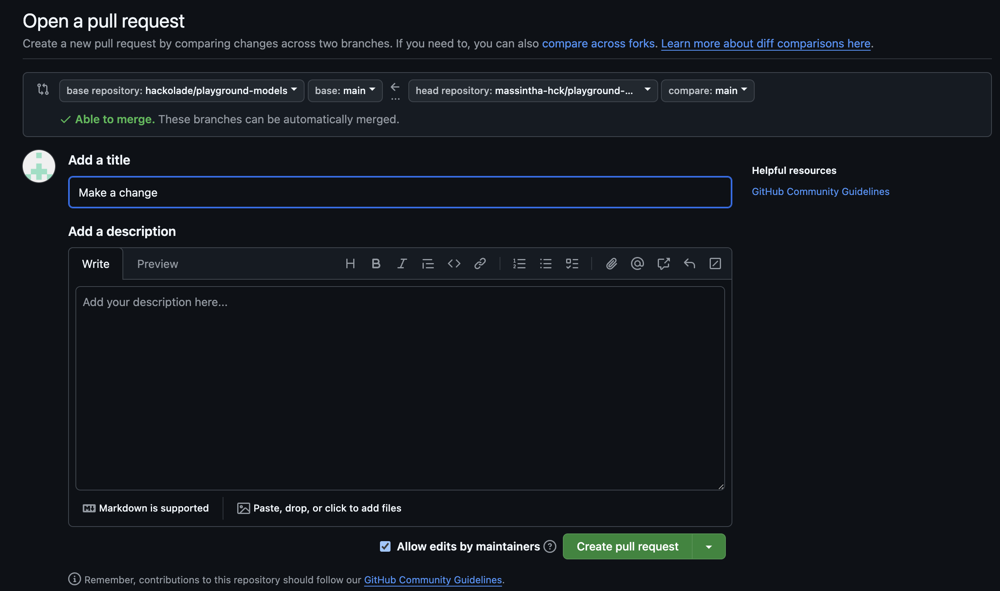

# playground-models
This repository contains Hackolade data models that can be viewed on https://hub.hackolade.com

The Hackolade Enterprise Model Hub is a metadata collaboration platform providing a unified and central access to your Hackolade Studio data models stored in one or more Git repositories. It empowers business teams, governance teams, and other stakeholders to collaborate effectively in order to promote a shared understanding of the context and meaning of data.

Feel free to explore at your leisure. It even allows you to [load your own models](#how-to-load-your-models-to-this-repository) into the repository, and view them in the Hub. We advise each organization to create its own folder, separate from others. The models and model changes you would push into the repository are auto-merged, then automatically replicated to the Hub database. They should appear in a few seconds.

An online user documentation can be found [here](https://hackolade.com/help/Hubuserinterface.html).

**WARNING:** the Hackolade Model Hub is totally open to anyone, so we strongly suggest to refrain from loading any confidential models.

Hackolade reserves the right to remove any inappropriate content from this repository, or any content that would negatively affect the platform.

## How to load your models to this repository
Follow these steps in order to add models to this repository

1. **Fork the repository**

    Click on this <a icon="repo-forked" class="github-button" href="https://github.com/hackolade/playground-models/fork">fork button</a> to copy this repository in your own GitHub account. This will open a form like the following

    

    You don't have to change anything, just click `Create fork`

1. Clone the new repository on your workstation by using your favorite Git tool or even better by using [Hackolade Studio](https://hackolade.com/help/Repository.html) to do so
   > Since this a is a public repository, make sure to not add any confidential models

   > We advise each organization to create its own folder, separate from others

1. When you are done, push the models on the forked repository

1. On the Github page, click on `Contribute` and `Open pull request` like shown on the picure below

    

1. On the pull request page, give a title to your pull request and then click `Create pull request`

    

1. After a few seconds, your pull request should be merged into the main repository and be visible on https://hub.hackolade.com
